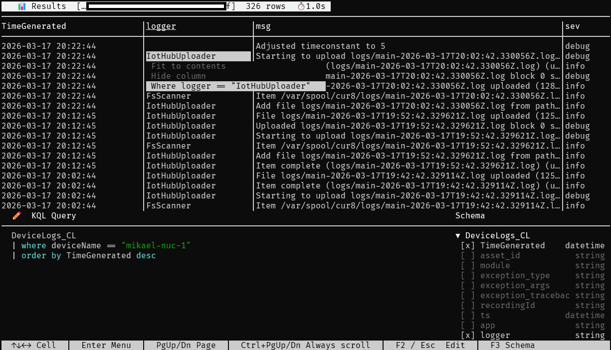
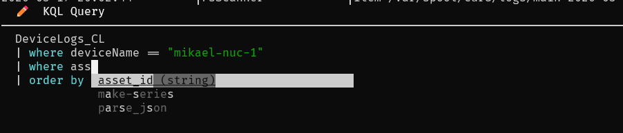
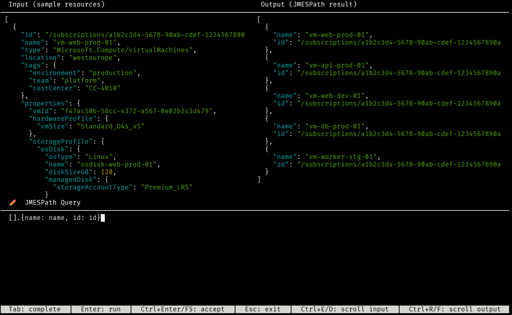
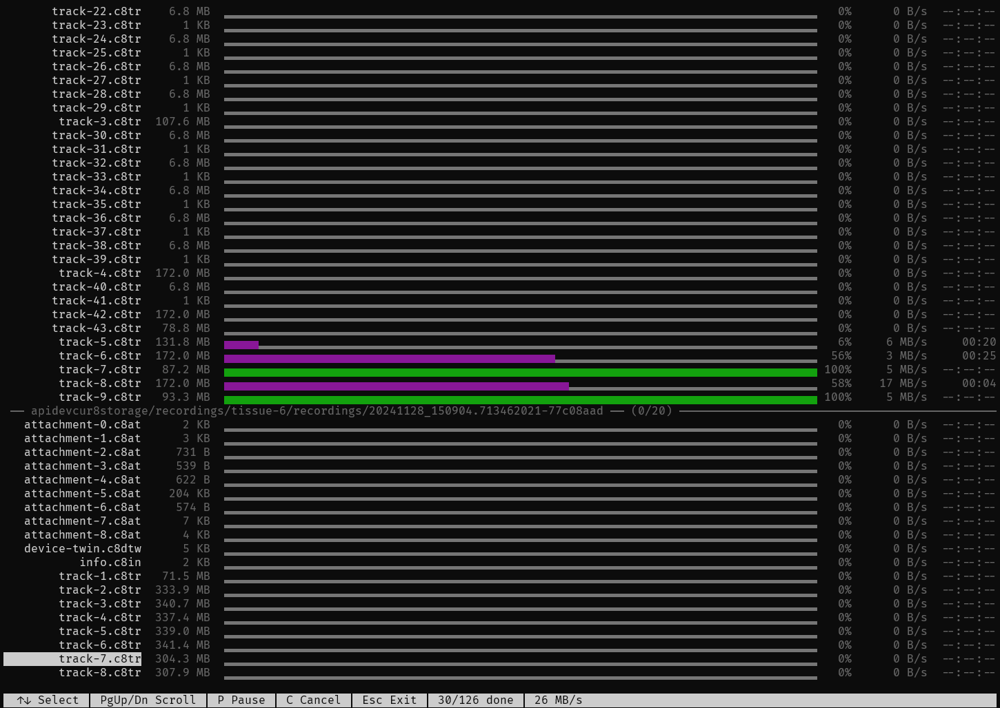

# maz

[](https://github.com/mauve/maz/actions/workflows/ci-cd.yml)

Self-contained Azure CLI written in C#.


_Because CLIs should be fast and snappy._

## Install

**Linux / macOS:**

```sh
curl -fsSL https://raw.githubusercontent.com/mauve/maz/master/install.sh | bash
```

**Windows (PowerShell):**

```powershell
irm https://raw.githubusercontent.com/mauve/maz/master/install.ps1 | iex
```

The binary is installed to `~/.local/bin/maz` (Linux/macOS) or `%USERPROFILE%\.local\bin\maz.exe` (Windows).
Both scripts warn you — and the PowerShell one offers to fix it — if the install directory is not yet on your `PATH`.

You can override the install location by setting `MAZ_INSTALL_DIR` before running the script.

---

## Overview

`maz` is a fast, self-contained Azure CLI replacement. It talks directly to the Azure REST API and ARM SDK — no Python, no virtual environments, no startup lag.

> [!TIP]
>
> Get started by running `maz bootstrap` or `maz configure`
> 

### Fuzzy command matching + suggestions

When you mistype a command, `maz` finds the closest match and asks if you meant that. In interactive terminals it shows a numbered menu; in non-interactive mode it prints the best match.

```
$ maz acount list
Did you mean: maz account list? (Y/n):
```

### Shell completions

Generate completions for your shell:

```sh
maz completion bash   >> ~/.bashrc
maz completion zsh    >> ~/.zshrc
maz completion fish   >> ~/.config/fish/completions/maz.fish
```

Completions include dynamic suggestions for resources directly `--key-vault`, `--subscription-id` and `--resource-group`.

### Resolving Resources

`maz` has considerable logic builtin to make addressing resources simpler. The full specification is in [ARM Resource Resolution Specification](./specs/ARM%20Resource%20Resolution%20Specification.md), but simply speaking it tries to do smart matching across subscriptions and resource-groups to find you resources for both control plane and data plane APIs.

This is without you having to supply `--subscription-id` and `--resource-group` in a lot of cases.

Also to make typing simpler you can supply subscription, resource group and resource name as a simple path:

> `--resource-name sub/rg/MyKeyVault`

Which means you don't need to specify separate arguments, and tab-completion works for the resource names as well.

## Interactive KQL experience with syntax highlighting and auto-complete

`maz loganalytics explore`



### Auto-complete on <TAB>

`maz loganalytics explore`



## Interactive JMESPath query editor

`maz jmespath editor`



## Blob Storage Copy Tool

`maz copy` can upload and download from blob storage accounts, but it can also copy from storage account to storage account, either via direct copy (storage to storage) or by forcing a download to upload. To preserve tags during download and upload the tool uses extended filesystem attributes or extended streams (NTFS).



### Extended File Attributes

When downloading blobs, `maz copy` stores blob metadata as extended file
attributes (xattr on Linux/macOS, NTFS Alternate Data Streams on Windows).

| Attribute                       | Stored when         | Description              |
| ------------------------------- | ------------------- | ------------------------ |
| `maz.blob.url`                  | Always              | Full blob URL            |
| `maz.blob.content-type`         | Always              | MIME type                |
| `maz.blob.tag.{key}`            | Always              | Blob index tag (per tag) |
| `maz.blob.content-md5`          | `--save-properties` | Base64 Content-MD5       |
| `maz.blob.etag`                 | `--save-properties` | ETag value               |
| `maz.blob.last-modified`        | `--save-properties` | ISO 8601 timestamp       |
| `maz.blob.cache-control`        | `--save-properties` | Cache-Control header     |
| `maz.blob.content-disposition`  | `--save-properties` | Content-Disposition      |
| `maz.blob.content-encoding`     | `--save-properties` | Content-Encoding         |
| `maz.blob.content-language`     | `--save-properties` | Content-Language         |
| `maz.blob.blob-type`            | `--save-properties` | BlockBlob / PageBlob     |
| `maz.blob.access-tier`          | `--save-properties` | Hot / Cool / Archive     |

On Linux, attributes are prefixed with `user.` (e.g. `user.maz.blob.url`).
Read them with `getfattr -d file` (Linux), `xattr -l file` (macOS), or
`Get-Content file -Stream maz.blob.url` (Windows). Attributes are best-effort:
silently skipped on filesystems without xattr support (FAT32, NFS, etc.).

Use `--verify` to re-read each downloaded file and compare its MD5 hash against
the blob's Content-MD5 header. Blobs without Content-MD5 are skipped with a
warning to stderr.

### Help flags

| Flag                       | Description                                                     |
| -------------------------- | --------------------------------------------------------------- |
| `--help`                   | Usage for the current command                                   |
| `--help-more`              | All options including advanced ones, with detailed descriptions |
| `--help-commands [filter]` | Full command tree, optionally filtered                          |

> [!TIP]
>
> Run `maz --help-commands` in an interactive terminal will give you an interactive experience where you can discover commands.
> 

### Data-plane vs. control-plane commands

Commands marked with `⚡` in help output operate against **data-plane endpoints** (e.g. Key Vault secrets API) rather than ARM. These require different authentication scopes and bypass the ARM gateway.

### Output formats

`maz` will try to render output in a human-friendly way by default (column) using color and auto-sizing columns. But the format can be changed using the `--format` key.

---

## Contributing

See [CONTRIBUTING.md](CONTRIBUTING.md) for build instructions, project structure, and how to make a release.
